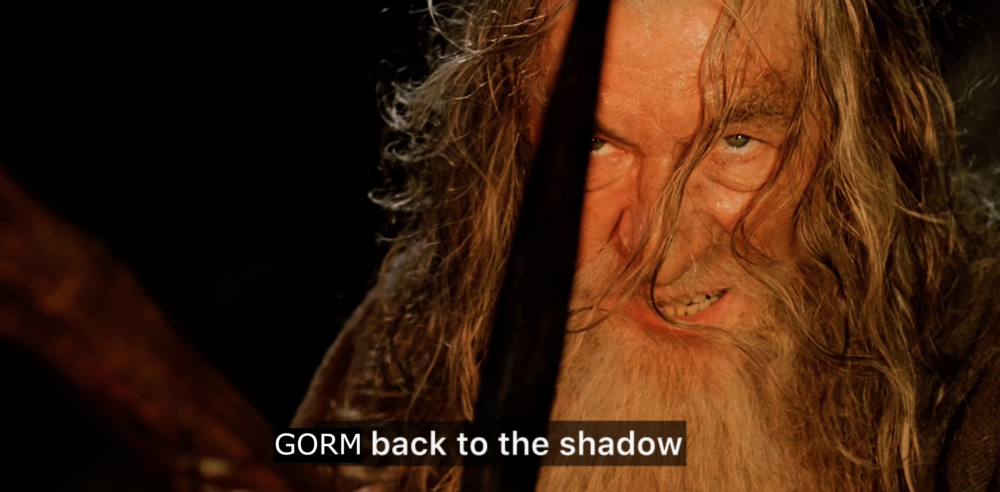

# gorm-shadow 🦇

<div>
  <p align="center">
    
  </p>
</div>

`gorm-shadow` is a plugin for [GORM](https://gorm.io) that allows you to shadow changes to a model's fields.

## User Guide 📚

### Installation

```bash
go get github.com/EelisK/gorm-shadow
```

### Usage

To use `gorm-shadow`, you need to import it and register it with your GORM instance.

Example:

```go
package main


import (
    "gorm.io/driver/sqlite"
    "gorm.io/gorm"
    "gorm.io/gorm/logger"
    "github.com/EelisK/gorm-shadow"
)


func main() {
    db, err := gorm.Open(sqlite.Open("test.db"), &gorm.Config{
        Logger: logger.Default.LogMode(logger.Info),
    })
    if err != nil {
        panic("failed to connect database")
    }

    db.Use(gormshadow.Plugin{})

    // Your code here
}
```

After registering the plugin, all the models that specify the `ShadowTable` function receiver will have their changes shadowed.

Example:

```go
package main

import (
    "gorm.io/gorm"
    "github.com/EelisK/gorm-shadow"
)

type User struct {
    gorm.Model
    Name string
}

func (u User) ShadowTable() string {
    return "shadow_users"
}

func main() {
    // Your code here
}
```

To automatically query the shadow table when querying the main table, you can provide a `TimeMachine` implementation to the plugin.

Example:

```go
type TimeMachine struct {}

func (t *TimeMachine) GetTime(ctx context.Context) time.Time {
    return ctx.Value("time").(time.Time)
}

func main() {
    db.Use(gormshadow.Plugin{
        TimeMachine: &TimeMachine{},
    })

    // Your code here
}
```
